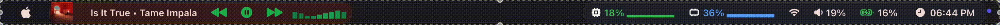
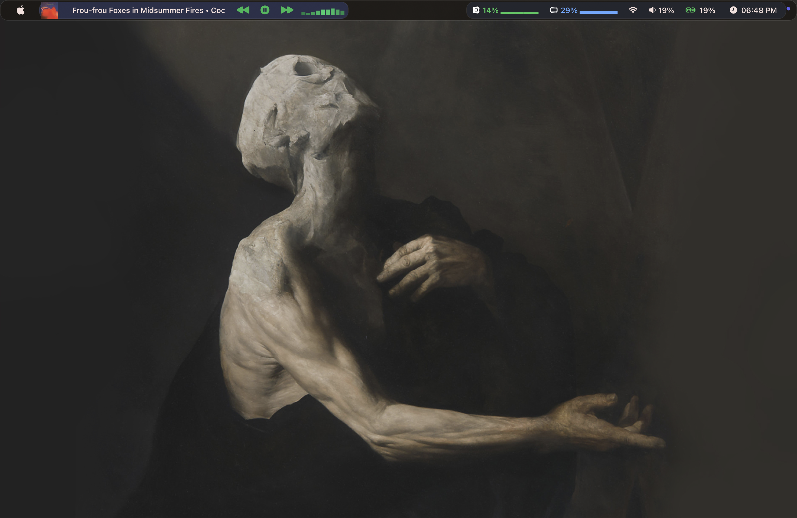

# 🍎 SketchyBar

A clean, macOS-inspired SketchyBar configuration focused on smooth animations, native styling, and a polished Spotify experience.

<p align="center">
  
</p>

<p align="center">
  
</p>

---

## ✨ Features

### 🎵 Spotify

- Live Spotify integration
- Animated Swift-powered visualizer (30 FPS)
- Dynamic album artwork
- Album-aware capsule tint
- Previous / Play-Pause / Next controls
- Auto-scrolling song titles
- Opens Spotify on click

### 📊 System

- CPU usage with animated sparkline history
- RAM usage with animated sparkline history
- Smart battery indicator
  - 🟢 Charging
  - ⚪ Above 20%
  - 🟡 Below 20%
  - 🔴 Below 10%
- Volume indicator
- Wi-Fi status
- Clock

### 🎨 Design

- Floating glassmorphism-inspired menu bar
- Rounded capsules
- Native SF Symbols
- SF Pro typography
- Smooth animations throughout
- Consistent spacing and sizing

---

## 📦 Requirements

- macOS
- SketchyBar
- nowplaying-cli
- ImageMagick
- jq
- Swift (for the Spotify visualizer)
- SF Pro
- JetBrainsMono Nerd Font

---

## 🚀 Installation

```bash
git clone https://github.com/poiuytsa/sketchybar.git

cp -R sketchybar ~/.config/

brew services restart sketchybar